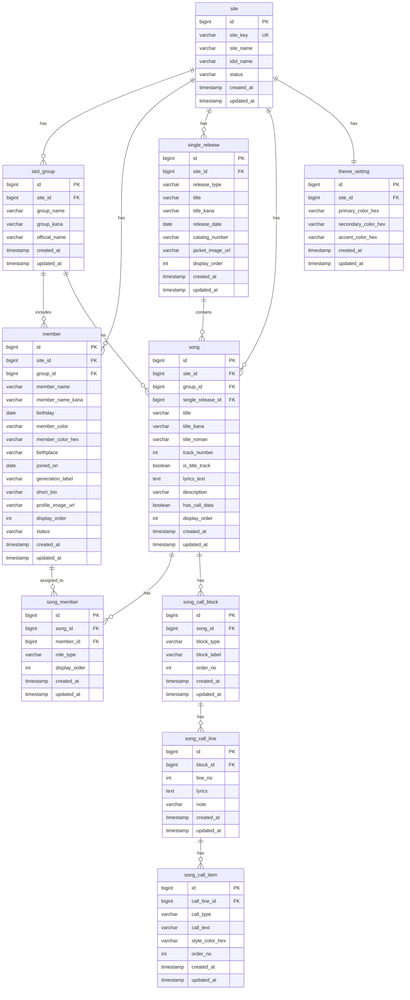

# ER図

## 改訂履歴

| Version | Date       | Author | Changes |
|---------|------------|--------|---------|
| 0.1.0   | 2026-03-22 | OpenAI | 初版作成 |

---

## 1. ER図（Mermaid）

---

## 2. ER図の補足

### 2.1 サイト起点
`site` を基点に設計することで、今後 =LOVE 以外のアイドルサイトを同じ基盤で増やせる。

### 2.2 楽曲とメンバー
`song` と `member` は多対多のため、中間テーブル `song_member` を設ける。

### 2.3 コール表現
コールは単純な文字列 1 本で持たず、以下の階層で表現する。

- song
- song_call_block
- song_call_line
- song_call_item

これにより、
- 歌詞行単位の表示
- 複数のコール付与
- コール種別色分け
- 将来の表現追加

に対応できる。

### 2.4 テーマ設定
今回はピンク基調固定に近いが、将来のサイトごとの世界観切り替えのため `theme_setting` を分離する。
