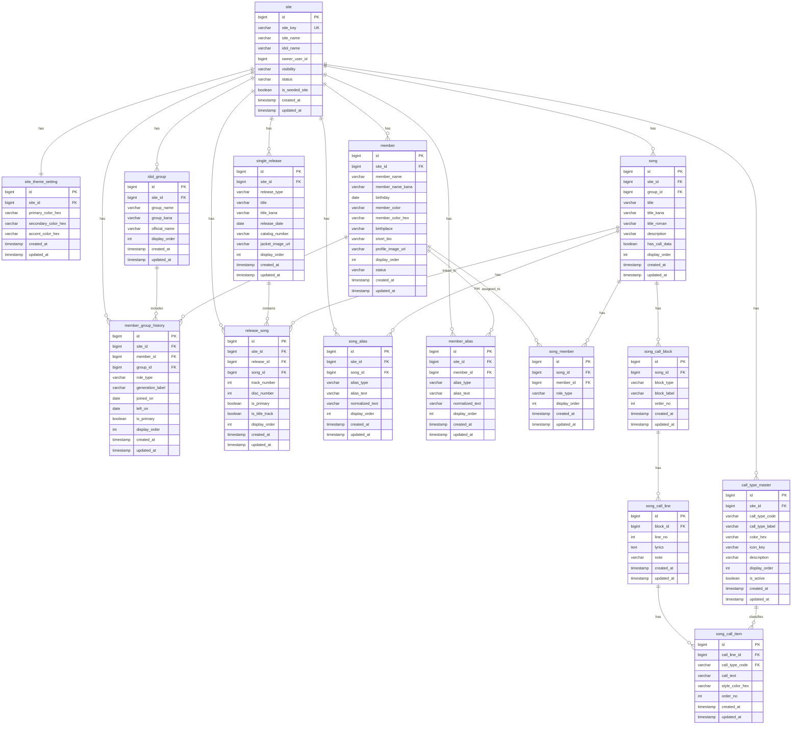

# ER図

## 改訂履歴

| Version | Date       | Author | Changes |
|---------|------------|--------|---------|
| 0.2.1   | 2026-03-23 | OpenAI | ユーザー作成型サービスを見据え、`site` の所有者・公開状態を反映 |
| 0.2.0   | 2026-03-23 | OpenAI | 拡張性重視で ER 図を更新。作品中間テーブル、所属履歴、別名、コール種別マスタを追加 |
| 0.1.0   | 2026-03-22 | OpenAI | 初版作成 |

---

## 1. ER図（Mermaid）

---

## 2. ER図の補足

### 2.1 サイト起点
`site` を基点に設計することで、今後 =LOVE 以外のアイドルサイトを同じ基盤で増やせる。  
また、`owner_user_id`, `visibility`, `status`, `is_seeded_site` を持つことで、後日のユーザー作成サイト、下書きサイト、運営初期サイトの区別にも対応しやすい。

### 2.2 楽曲と作品
`song` と `single_release` は直接結ばず、`release_song` を介して関連付ける。  
これにより、同一楽曲の複数作品収録や代表作品管理に対応できる。

### 2.3 メンバー所属
メンバーの所属は `member_group_history` を正とする。  
これにより、兼任、卒業、再加入、期変更に対応できる。

### 2.4 検索別名
別名は `song_alias`, `member_alias` へ分離し、本体テーブルの列増加を防ぐ。

### 2.5 コール表現
コールは単純な文字列 1 本で持たず、以下の階層で表現する。

- `song`
- `song_call_block`
- `song_call_line`
- `song_call_item`

さらに、`call_type_master` を参照することで、色・ラベル・アイコンをサイトごとに拡張できる。
